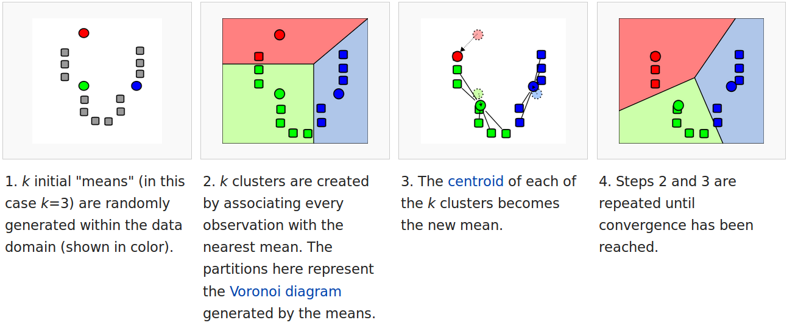
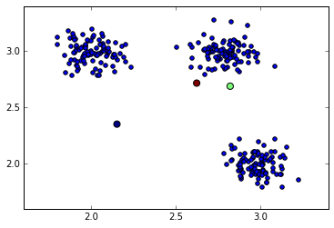

K-means is a simple algorithm to cluster data that is to identify groups of similar objects based only on their properties. The algorithm is best-illustrated by the following graph.




### Generating data

We first need to generate some data. We will make an artificial data set consisiting of three clusters at different centers with gaussian noise around the centers. For simplicity, each of the cluster contains 100 points.


```python
import numpy as np
import matplotlib.pyplot as plt

centers = np.array([[  2, 3], 
                    [  3, 2],
                    [2.8, 3]])
noise = 0.1 * np.random.randn(100, 3, 2)
```

We will take advantage of broadcasting to move the clusters to their centers:

```python
clusters = noise + centers
```

The K-means algorithm should be naive about the identity of the clusters. So we merge all clusters together using `reshape` and shuffle the points:


```python
data = clusters.reshape(100 * 3, 2)
np.random.shuffle(data)
plt.scatter(data[:, 0], data[:, 1])
```


### Initialisation

In the first step of the algorithm we need to initialise the centers of the clusters. We will initialise them randomly but consistently with the mean and standard deviation of the data:


```python
K = 3
k_centers = np.random.randn(K, 2) * np.std(data, 0) + np.mean(data, 0)
```

Lets now plot the data and the random cluster centers on the same figure:


```python
plt.scatter(data[:, 0], data[:, 1])
cluster_colors = np.arange(3)
plt.scatter(k_centers[:, 0], k_centers[:, 1], c=cluster_colors, s=50)
```




### Assignment

We now need to assign each point to the closest cluster center. First, we will calculate the Euclidean distance of each point to each of the centers. For this we can use the **broadcasting**:


```python
deltas = data[np.newaxis, :, :] - k_centers[:, np.newaxis, :]
center_distance = np.sqrt(np.sum(deltas**2, 2))
```

For each data point we find the center with minimum distance. We can use the `argmin` method with the axis argument:


```python
closest_center = center_distance.argmin(0)
```

```python
plt.scatter(data[:, 0], data[:, 1], c=closest_center)
cluster_colors = np.arange(3)
plt.scatter(k_centers[:, 0], k_centers[:, 1], c=cluster_colors, s=50)
```


We are going to re-use this code, so lets define two functions &mdash; one for cluster assignment and another for plotting:


```python
def assign(data, k_centers):
    """Assign each data point to closest center.
    Returns an array of cluster indices"""
    deltas = data[np.newaxis, :, :] - k_centers[:, np.newaxis, :]
    center_distance = np.sqrt(np.sum((deltas)**2, 2))
    closest_center = center_distance.argmin(0)
    return closest_center

def show_clusters(data, k_centers, closest_center):
    """Plot clusters and their centers"""
    plt.scatter(data[:, 0], data[:, 1], c=closest_center)
    cluster_colors = np.arange(3)
    plt.scatter(k_centers[:, 0], k_centers[:, 1], c=cluster_colors, s=50)
```

### Calculate new cluster centers

To calculate new centers of the clusters, we average all points belonging to that cluster. We can use a **boolean mask**. For example, to calculate the center of a cluster 0 we will use the following instruction:


```python
data[closest_center==0, :].mean(0)
```

```
array([ 2.90695091,  2.52099101])
```

To repeat it for all clusters we can use a for loop or list comprehension. Since the number of clusters is usually much smaller than the number of data points, this for loop won't affect the performance of our algorithm:


```python
k_centers = np.array([data[closest_center==c, :].mean(0) for c in range(3)])
```

Lets check the positions of new centers and assignment of points to clusters:


```python
closest_center = assign(data, k_centers)
show_clusters(data, k_centers, closest_center)
```


Again, we will define a function for later re-use:


```python
def move_centers(data, closest_center):
    """Update cluster centers based on new cluster membership"""
    k_centers = np.array([data[closest_center==c, :].mean(0) for c in range(3)])
    return k_centers
```

### Iterations

Now we can repeat the steps of assigning point to clusters and updating the cluster centers iteratively and watch the progress of the algorithm:


```python
n_iterations = 3
for i in range(n_iterations):
    k_centers = move_centers(data, closest_center)
    closest_center = assign(data, k_centers)
    plt.figure()
    show_clusters(data, k_centers, closest_center)
```


> ## Single cluster? {.callout}
>
> Note that sometimes the algorithm can produce degenerate results -- all of the points will be assigned to a single cluster (or final number of clusters will be less than K). This is one of drawbacks of K-means with random initialisations. A possible solution is to repeat the algorithm with other initialisations and find the best cluster assignment, but better solutions exist.

### Putting it all together

Our final script will look as the following:

```python
import numpy as np
import matplotlib.pyplot as plt

def assign(data, k_centers):
    """Assign each data point to closest center.
    Returns an array of cluster indices"""
    deltas = data[np.newaxis, :, :] - k_centers[:, np.newaxis, :]
    center_distance = np.sqrt(np.sum((deltas)**2, 2))
    closest_center = center_distance.argmin(0)
    return closest_center

def show_clusters(data, k_centers, closest_center):
    """Plot clusters and their centers"""
    plt.scatter(data[:, 0], data[:, 1], c=closest_center)
    cluster_colors = np.arange(3)
    plt.scatter(k_centers[:, 0], k_centers[:, 1], c=cluster_colors, s=50)
    
def move_centers(data, closest_center):
    """Update cluster centers based on new cluster membership"""
    k_centers = np.array([data[closest_center==c, :].mean(0) for c in range(3)])
    return k_centers

# generate data
centers = np.array([[  2, 3], 
                    [  3, 2],
                    [2.8, 3]])
noise = 0.1 * np.random.randn(100, 3, 2)
clusters = noise + centers
data = clusters.reshape(100 * 3, 2)
np.random.shuffle(data)

# cluster data
K = 5
n_features = 2
n_iterations = 5
k_centers = np.random.randn(K, n_features) * np.std(data, 0) + np.mean(data, 0)
closest_center = assign(data, k_centers)
for i in range(n_iterations):
    k_centers = move_centers(data, closest_center)
    closest_center = assign(data, k_centers)
show_clusters(data, k_centers, closest_center)
```

> ## Choice of K {.challenge}
>
> Modify the algorithm so that it works for any K. Try using K > 3. What happens then?

> ## Memory or speed {.challenge}
>
> Replace the assignment and calculation of new clusters with a for loop. Which implementation would be preferable for small (few observations and dimensions) and which for large datasets (large number of observations and dimensions).
